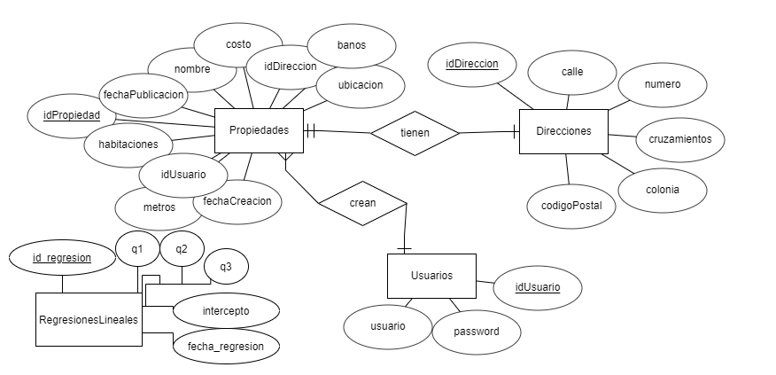

# Documento de Arquitectura de Software para el proyecto "Home Run Software"
## Indice
1. [Introducción](#intro)
2. [Arquitectura](#arqui)
3. [Documentación de la API](#api)
4. [Criterios de Calidad](#calidad)
<a name="intro"></a>
## Introducción

### Propósito
Describir la arquitectura que será utilizada para el desarrollo del proyecto "Home Run Software" a través de la conceptualización de cada uno de sus componentes.
### Alcance
El presente documento será de utilidad para los desarrolladores de "Home Run Software". Se espera que al revisarlo se entiendan todas las componentes del proyecto, así como la relación que existe entre ellas. Para ello, será necesario describir rigurosamente todos los procesos y entidades del sistema a través de diagramas UML. Teniendo claro el diseño del software, se podrá continuar con la fase de construcción del software.
### Documentos de referencia
[Plantilla de la IEEE para el desarrollo de documentos de arquitectura de software](https://www.google.com/url?sa=t&rct=j&q=&esrc=s&source=web&cd=&ved=2ahUKEwj__8njzIztAhUFWN8KHQWPA50QFjAAegQIBRAC&url=http%3A%2F%2Fwww.iso-architecture.org%2Fieee-1471%2Ftemplates%2F42010-vp-template.doc&usg=AOvVaw2FPIjkVX0mIpPNCDqKFi9V)
<br/>[Ejemplo de un documento de arquitectura desarrollado bajo los estandares de la IEEE](https://www.google.com/url?sa=t&rct=j&q=&esrc=s&source=web&cd=&ved=2ahUKEwj__8njzIztAhUFWN8KHQWPA50QFjABegQIARAC&url=https%3A%2F%2Fwww.rose-hulman.edu%2Fclass%2Fcsse%2Fcsse477%2Fhandouts_377%2FSoftArchDocTemplate.doc&usg=AOvVaw0Wp5NHYKive-XjYv83jWzQ)
<a name="arqui"></a>
## Arquitectura

### Descripción de la Arquitectura utilizada
La arquitectura por capas es una de las formas más simples de los patrones arquitectónicos de software. En esta arquitectura los componentes son organizados en capas horizontales. Estas capas son independientes y se comunican únicamente con las capas adyacentes. Una arquitectura por capas general puede constar de n-capas sin embargo la implementación más común consta de 4 capas que son: Capa de Presentación, Capa de Lógica de negocio (Bussiness Layer), Capa de Persistencia y Capa de Almacenamiento. Las ventajas de usar esta arquitectura es que es sencilla de implementar y probar. Las desventajas es que la aplicación se vuelve difícil de modificar y escalar.
### Definición teórica de Microservicios
Es un acercamiento para desarrollar una aplicación como un conjunto de pequeños servicios, cada uno corriendo sus propios procesos y comunicando con mecanismos ligeros. Cada microservicio debe ser desplegable y escalable de manera independiente y cada servicio tiene límites definidos permitiendo que los diferentes servicios sean escritos en diferentes lenguajes de programación.

### Diagrama de arquitectura con descripción

En este diagrama se pueden observar los componentes principales del sistema. El componente llamado "App" representa la API a través de la  cual se ingresará la información de las propiedades. La "App" luego almacena la información en la base de datos. Al almacenarse información en la base de datos la información es tomada por la "App de ML" que usa un algoritmo de regresión lineal para poder predecir valores de hogares por zonas. Los resultados de este algoritmo es luego almacenado en la base de datos.
### Diagrama de secuencia


### Diagrama Entidad Relación

### Descripción de las Entidades
#### Usuarios
Representa a las personas del mundo real que pueden agregar y eliminar propiedades de la base de datos por medio del sistema. Esta tabla mantendrá un registro de cada usuario con esos permisos y serán introducidos manualmente. Tiene una relación de uno a muchos con la entidad *Propiedades* ya que un usuario puede crear cero o más propiedades, se relacionará mediante su llave primaria "idUsuario".
#### Direcciones
Dentro de esta entidad se encontrarán los datos de la dirección exacta de la propiedad. Tiene una relación de uno a uno con la entidad *Propiedades* ya que cada dirección es única y propia de la propiedad, estas entidades se relacionarán mediante la llave primaria "idDireccion".
#### Propiedades
Contiene todos los datos de las casas en venta registradas en el sistema. Esta tabla es la principal del sistema ya que sus registros serán directamente consultados con los métodos GET. Está relacionada con la entidad *Direcciones* mediante la llave foránea "idDireccion", y con la entidad *Usuarios* mediante la llave foránea "idUsuario". Los registros de esta tabla serán introducidos a través del sistema utilizando los métodos POST. A continuación se describirán algunos de sus atributos.
* **Atributos**:
  * "Banos": Cantidad de baños en la propiedad.
  * "Metros": Área del terreno en el que está ubicada la propiedad.
  * "FechaPublicación": Fecha en la que la propiedad se encontrará disponible a venta o renta.
  * "FechaCreacion": Fecha en la que se generó el registro de la propiedad en la base de datos.
  * "Ubicacion": Zona de la ciudad en la que se ubica el terreno de la propiedad (oriente, poniente, norte o sur).

<a name="api"></a>
## Documentación de la API
### Endpoints
* [Listar propiedades](#listarPropiedades) : `GET /api/propiedades/{page}`
* [Listar propiedades con filtro](#listarPropiedades) : `POST /api/propiedades/{page}`
* [Listar propiedad especifica](#listarEspecifica) : `GET /api/propiedades/{id}`
* [Crear propiedad](#crearPropiedad) : `POST /api/propiedades/`
* [Crear propiedades desde csv](#crearCSV) : `POST /api/propiedades/carga_masiva`
* [Actualizar propiedad](#actualizarPropiedad) : `PUT /api/propiedades/{id}`
* [Eliminar propiedad](#eliminarPropiedad) : `DELETE /api/propiedades/{id}`
* Grafica de Precios por Ubicacion : `GET /api/graficas/ubicacion/precio`
* Grafica de cantidad de Propiedades por Ubicacion : `GET /api/graficas/ubicacion/casas`
* Grafica de Precios por Metros Cuadrados : `GET /api/graficas/metros/precio`
* [Predicción de Precio de propiedad](#prediccion) : `POST /api/prediccionCostoPropiedad`

#### <a name="listarPropiedades"></a> Listar propiedades
* URI :
  * `GET /api/propiedades?{parametros_opcionales}`
* Descripción:
  * Se utiliza para obtener el listado de las propiedades registradas en el sistema
  junto con su información correspondiente.
* Parametros opcionales
  * cantidad : Integer - Cantidad de elementos a obtener
  * offset : Integer - Indice donde comenzará el listado de propiedades
  * costoMenor : float - Cantidad para buscar propiedades con costo menor que el indicado en este parametro
  * costoMayor : float - Cantidad para buscar propiedades con costo mayor que el indicado en este parametro
  * ubicacion : String (Norte, Sur, Este, Oeste, Centro) - Valor para buscar por ubicación de la propiedad
  * colonia : String - Valor de búsqueda por colonia
  * metrosMenor : float - Cantidad para buscar propiedades con metros cuadrados menor que el indicado en este parámetro
  * metrosMayor : float - Cantidad para buscar propiedades con metros cuadrados mayor que el indicado en este parámetro
  * banos : integer - Cantidad de baños deseados en la propiedad
  * habitaciones : integer - Cantidad de habitaciones deseadas en la propiedad
  * fechaPublicacion : String (Y-m-d H:i:s) - Fecha de publicación de la propiedad
* Ejemplo de solicitud:
  * `GET /api/propiedades?cantidad=1&metros=56`
* Respuesta (200OK):
```json    
  {
    "1": {
      "costo" : 1000000.00,
      "ubicacion" : "Oriente",
      "direccion" : {
        "idDireccion" : 1,
        "calle" : "48",
        "numero" : "478",
        "cruzamientos" : "53 y 56",
        "colonia" : "México Oriente"
      },
      "metros" : 56,
      "banos" : 2.5,
      "habitaciones" : 3,
      "fechaPublicacion" : "2009-03-02 23:13:36",
      "fechaCreacion" : "2009-03-02 23:13:36",
      "idusuario" : 3
    },
    "2": {
      "costo" : 3500140.00,
      "ubicacion" : "Norte",
      "direccion" : {
        "idDireccion" : 2,
        "calle" : "48",
        "numero" : "478",
        "cruzamientos" : "53 y 56",
        "colonia" : "Francisco de Montejo"
      },
      "metros" : 100,
      "banos" : 4,
      "habitaciones" : 4,
      "fechaPublicacion" : "2009-03-02 23:13:36",
      "fechaCreacion" : "2009-03-02 23:13:36",
      "idusuario" : 3
    }
  }         
```

#### <a name="listarEspecifica"></a> Listar propiedad especifica
* URI :
  * `GET /api/propiedades/{id}`
* Descripción:
  * Se utiliza para obtener la información de una propiedad especifica registrada
  en el sistema.
* Respuesta (200OK):    
```json    
  {
    "1": {
      "costo" : 1000000.00,
      "ubicacion" : "Oriente",
      "direccion" : {
        "idDireccion" : 1,
        "calle" : "48",
        "numero" : "478",
        "cruzamientos" : "53 y 56",
        "colonia" : "México Oriente"
      },
      "metros" : 56,
      "banos" : 2.5,
      "habitaciones" : 3,
      "fechaPublicacion" : "2009-03-02 23:13:36",
      "fechaCreacion" : "2009-03-02 23:13:36",
      "idusuario" : 3
    }
  }
```       
* Ejemplo de request: `GET /api/propiedades/1`
  * Respuesta (200OK):
```json
    {
      "1": {
        "costo" : 1000000.00,
        "ubicacion" : "Oriente",
        "direccion" : {
          "idDireccion" : 1,
          "calle" : "48",
          "numero" : "478",
          "cruzamientos" : "53 y 56",
          "colonia" : "México Oriente"
        },
        "metros" : 56,
        "banos" : 2.5,
        "habitaciones" : 3,
        "fechaPublicacion" : "2009-03-02 23:13:36",
        "fechaCreacion" : "2009-03-02 23:13:36",
        "idusuario" : 3
      }
    }     
```    

#### <a name="listarPaginadas"></a> Listar propiedades paginadas
* URI :
  * `GET /api/propiedades/{page}`
* Descripción:
  * Se utiliza para solicitar una búsqueda con la capacidad de paginar las listarPropiedades
  en conjunto con la información de estas registradas en el sistema.
* Ejemplo de request: `GET /api/propiedades/1`
  * Descripción: La respuesta son un total de 5 propiedades comenzando desde la propiedad con el id 6, por lo que se devolverá el listado de las propiedades de la 6 a la 10.
  * Respuesta (200OK):
```json    
    {
      "6": {
        "costo" : 1000000.00,
        "ubicacion" : "Oriente",
        "direccion" : {
          "idDireccion" : 1,
          "calle" : "48",
          "numero" : "478",
          "cruzamientos" : "53 y 56",
          "colonia" : "México Oriente"
        },
        "metros" : 56,
        "banos" : 2.5,
        "habitaciones" : 3,
        "fechaPublicacion" : "2009-03-02 23:13:36",
        "fechaCreacion" : "2009-03-02 23:13:36",
        "idusuario" : 3
      },

      ...      

      "10": {
        "costo" : 3500140.00,
        "ubicacion" : "Norte",
        "direccion" : {
          "idDireccion" : 2,
          "calle" : "48",
          "numero" : "478",
          "cruzamientos" : "53 y 56",
          "colonia" : "Francisco de Montejo"
        },
        "metros" : 100,
        "banos" : 4,
        "habitaciones" : 4,
        "fechaPublicacion" : "2009-03-02 23:13:36",
        "fechaCreacion" : "2009-03-02 23:13:36",
        "idusuario" : 3
      }
    }         
```  

#### <a name="crearPropiedad"></a> Crear propiedades
* URI :
  * `POST /api/propiedades`
* Descripción:
  * Se utiliza para realizar el registro de una propiedad dentro del sistema.
* Campos requeridos:
```
  {
    "usuario" : String,
    "password" : String,
    "costo" : Float con dos puntos decimales,
    "ubicacion" : String,
    "direccion" : {
      "calle" : String,
      "numero" : String,
      "cruzamientos" : String,
      "colonia" : String
    },
    "metros" : Integer,
    "banos" : float,
    "habitaciones" : Integer,
    "fechaPublicacion" : String (Y-m-d H:i:s),
    "fechaCreacion" : String (Y-m-d H:i:s),
  }
```
* Respuesta (200OK):    
```json
  {
    "3": {
      "costo" : 1000000.00,
      "ubicacion" : "Oriente",
      "direccion" : {
        "idDireccion" : 5,
        "calle" : "48",
        "numero" : "478",
        "cruzamientos" : "53 y 56",
        "colonia" : "México Oriente"
      },
      "metros" : 56,
      "banos" : 2.5,
      "habitaciones" : 3,
      "fechaPublicacion" : "2009-03-02 23:13:36",
      "fechaCreacion" : "2009-03-02 23:13:36",
      "idusuario" : 3
    }
  }     
```  
* Ejemplo de request: `POST /api/propiedades`
  * Request:
```json
    {
      "usuario" : "a16016263@alumnos.uady.mx",
      "password" : "123123",
      "costo" : 1000000.00,
      "ubicacion" : "Oriente",
      "direccion" : {
        "calle" : "48",
        "numero" : "478",
        "cruzamientos" : "53 y 56",
        "colonia" : "México Oriente"
      },
      "metros" : 56,
      "banos" : 2.5,
      "habitaciones" : 3,
      "fechaPublicacion" : "2009-03-02 23:13:36",
      "fechaCreacion" : "2009-03-02 23:13:36"
    }
```
  * Respuesta (200OK):
```json
    {
      "1": {
        "costo" : 1000000.00,
        "ubicacion" : "Oriente",
        "direccion" : {
          "idDireccion" : 4,
          "calle" : "48",
          "numero" : "478",
          "cruzamientos" : "53 y 56",
          "colonia" : "México Oriente"
        },
        "metros" : 56,
        "banos" : 2.5,
        "habitaciones" : 3,
        "fechaPublicacion" : "2009-03-02 23:13:36",
        "fechaCreacion" : "2009-03-02 23:13:36",
        "idusuario" : 3
      }
    }     
```

#### <a name="crearCSV"></a> Crear propiedades desde CSV
* URI :
  * `POST /api/propiedades/carga_masiva`
* Descripción:
  * Se utiliza para realizar el registro de propiedades dentro del sistema por medio de un archivo csv.
* Campos requeridos en cada entrada del csv:
```
    "usuario" : String,
    "password" : String,
    "costo" : Float con dos puntos decimales,
    "ubicacion" : String,
    "calle" : String,
    "numero" : String,
    "cruzamientos" : String,
    "colonia" : String,
    "metros" : Integer,
    "banos" : float,
    "habitaciones" : Integer,
    "fechaPublicacion" : String (Y-m-d H:i:s),
    "fechaCreacion" : String (Y-m-d H:i:s),
```
* Respuesta (200OK):    
```json
  {
    "3": {
      "costo" : 1000000.00,
      "ubicacion" : "Oriente",
      "direccion" : {
        "idDireccion" : 5,
        "calle" : "48",
        "numero" : "478",
        "cruzamientos" : "53 y 56",
        "colonia" : "México Oriente"
      },
      "metros" : 56,
      "banos" : 2.5,
      "habitaciones" : 3,
      "fechaPublicacion" : "2009-03-02 23:13:36",
      "fechaCreacion" : "2009-03-02 23:13:36",
      "idusuario" : 3
    },
    "4": {
      "costo" : 1050000.00,
      "ubicacion" : "Poniente",
      "direccion" : {
        "idDireccion" : 5,
        "calle" : "58",
        "numero" : "121",
        "cruzamientos" : "63 y 66",
        "colonia" : "México Poniente"
      },
      "metros" : 56,
      "banos" : 2.5,
      "habitaciones" : 3,
      "fechaPublicacion" : "2009-03-02 23:13:36",
      "fechaCreacion" : "2009-03-02 23:13:36",
      "idusuario" : 3
    },
    ...
  }     
```  
* Ejemplo de request: `POST /api/propiedades/csv`
  * Request:
```
    POST /api/propiedades/csv HTTP/1.1
    Host: localhost:8080
    User-Agent: insomnia/2020.4.2
    Content-Type: text/csv
    Accept: */*
    Content-Length: 1303
```
  * Respuesta (200OK):
```json
    {
      "1": {
        "costo" : 1000000.00,
        "ubicacion" : "Oriente",
        "direccion" : {
          "idDireccion" : 4,
          "calle" : "48",
          "numero" : "478",
          "cruzamientos" : "53 y 56",
          "colonia" : "México Oriente"
        },
        "metros" : 56,
        "banos" : 2.5,
        "habitaciones" : 3,
        "fechaPublicacion" : "2009-03-02 23:13:36",
        "fechaCreacion" : "2009-03-02 23:13:36",
        "idusuario" : 3
      },
      "2": {
        "costo" : 1050000.00,
        "ubicacion" : "Poniente",
        "direccion" : {
          "idDireccion" : 5,
          "calle" : "58",
          "numero" : "121",
          "cruzamientos" : "63 y 66",
          "colonia" : "México Poniente"
        },
        "metros" : 56,
        "banos" : 2.5,
        "habitaciones" : 3,
        "fechaPublicacion" : "2009-03-02 23:13:36",
        "fechaCreacion" : "2009-03-02 23:13:36",
        "idusuario" : 3
      }
    }
```
  * Ejemplo de CSV
  ```CSV
  CASA 3 habitaciones en el norte,1000000,4,NORTE,14,12,5 y 5a,tepito,97130,3,200
CASA 2 habitaciones en el norte,800000,3,NORTE,11,15,12 y 13,fco de montejo,97000,2,150
  ```

#### <a name="actualizarPropiedad"></a> Actualizar propiedad
* URI :
  * `PUT /api/propiedades/{id}`
* Descripción:
  * Se utiliza para modificar la información de una propiedad especifica registrada
  en el sistema.
* Campos requeridos:
```
  {
    "usuario" : String,
    "password" : String,
    "costo" : Float con dos puntos decimales,
    "ubicacion" : String,
    "direccion" : {
      "calle" : String,
      "numero" : String,
      "cruzamientos" : String,
      "colonia" : String
    },
    "metros" : Integer,
    "banos" : float,
    "habitaciones" : Integer,
    "fechaPublicacion" : String (Y-m-d H:i:s),
    "fechaCreacion" : String (Y-m-d H:i:s),
  }
```
* Respuesta (200OK):    
```json    
  {
    "1": {
      "costo" : 1000000.00,
      "ubicacion" : "Oriente",
      "direccion" : {
        "idDireccion" : 1,
        "calle" : "48",
        "numero" : "478",
        "cruzamientos" : "53 y 56",
        "colonia" : "México Oriente"
      },
      "metros" : 56,
      "banos" : 2.5,
      "habitaciones" : 3,
      "fechaPublicacion" : "2009-03-02 23:13:36",
      "fechaCreacion" : "2009-03-02 23:13:36",
      "idusuario" : 3
    }
  }
```       
* Ejemplo de request: `PUT /api/propiedades/1`
  * Request:
```json
    {
      "usuario" : "a16016263@alumnos.uady.mx",
      "password" : "123123",
      "costo" : 1000000.00,
      "ubicacion" : "Oriente",
      "direccion" : {
        "calle" : "48",
        "numero" : "478",
        "cruzamientos" : "53 y 56",
        "colonia" : "México Oriente"
      },
      "metros" : 56,
      "banos" : 2.5,
      "habitaciones" : 3,
      "fechaPublicacion" : "2009-03-02 23:13:36",
      "fechaCreacion" : "2009-03-02 23:13:36"
    }
```
  * Respuesta (200OK):
```json
    {
      "1": {
        "costo" : 1000000.00,
        "ubicacion" : "Oriente",
        "direccion" : {
          "idDireccion" : 1,
          "calle" : "48",
          "numero" : "478",
          "cruzamientos" : "53 y 56",
          "colonia" : "México Oriente"
        },
        "metros" : 56,
        "banos" : 2.5,
        "habitaciones" : 3,
        "fechaPublicacion" : "2009-03-02 23:13:36",
        "fechaCreacion" : "2009-03-02 23:13:36",
        "idusuario" : 3
      }
    }     
```

#### <a name="eliminarPropiedad"></a> Eliminar propiedad
* URI :
  * `DELETE /api/propiedades/{id}`
* Descripción:
  * Se utiliza para eliminar la información de una propiedad especifica registrada
  en el sistema.
* Respuesta (200OK):    
```json    
  {
    "respuesta": "La propiedad {id} ha sido eliminada"
  }
```       
* Ejemplo de request: `DELETE /api/propiedades/1`
  * Respuesta (200OK):
```json    
  {
    "respuesta": "La propiedad 1 ha sido eliminada"
  }
```  

#### <a name="prediccion"></a> Predicción de precio de propiedad
* URI :
  * `POST /api/prediccionCostoPropiedad`
* Descripción:
  * Se utiliza para obtener una predicción del costo de una propiedad en base a sus habitaciones, cantidad de baños y metros cuadrados de la propiedad. Utilizando un script de R con una formula de regresión lineal.
* Respuesta (200OK):    
```json    
  {
    "respuesta": "El precio de la propiedad es de {precio}"
  }
```       
* Ejemplo de request: `POST /api/prediccionCostoPropiedad`
```json
    {
      "habitaciones": 4,
      "banos": 2,
      "metros_cuadrados": 100
    }
```

<a name="calidad"></a>
## Criterios de Calidad de la API
Criterios de calidad clasificados por su enfoque de calidad

### Fiabilidad
- Toda funcionalidad del sistema y transacción de negocio va a responder al usuario en menos de 5 segundos.
- Los datos modificados en la base de datos van a ser actualizados en menos de 2 segundos.

### Eficiencia
- Al momento de realizar un proceso, este no debe de sobrepasar el 20% del uso del CPU.
- La carga en memoria no debe superar a los 20 Kb, 30 Kb.

### Seguridad
- El sistema va a estar protegido contra intrusiones externas o usuarios malintencionados.

### Usabilidad
- El tiempo de aprendizaje del sistema por un usuario va a ser menor a 2 horas.
- La tasa de errores cometidos por el usuario va a ser menor del 1% de las transacciones  totales ejecutadas en el sistema.
- El sistema va a proporcionar mensajes de error que sean informativos y orientados a usuario final.

### Dependabilidad
- El tiempo para iniciar o reiniciar el sistema va a ser menor a 2 minutos.
- El promedio de duración de fallas va a ser menor a 2 minutos.

### Compatibilidad/Portabilidad
- Las pruebas de software van a ser gestionadas con una herramienta de gestión de software testing.
- El programa va a estar escrito y preparado de manera comprensible para cualquier desarrollador nuevo que quiera comprender el programa.
